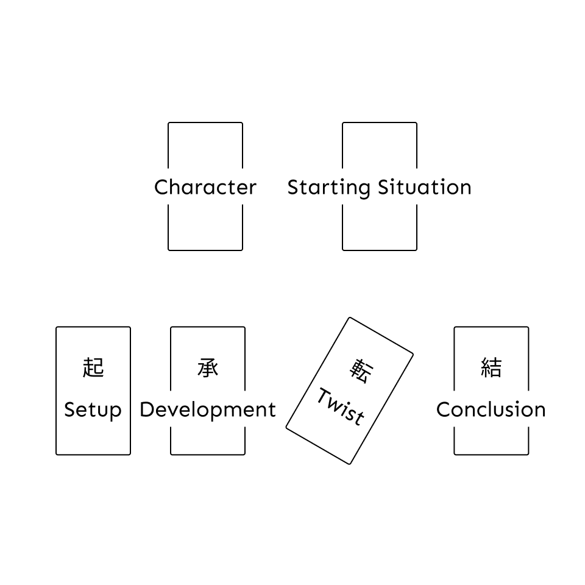

# P02 Game Design Document

v0.1 - Justin Kim - 12/19/21-12/23/21
- Finished spitballing my ideas and thoughts.

## Working title

[Kishotenketsu Tarot Spread Game](https://docs.google.com/document/d/1bgnpU05j40BGx25Rpb4umxYWp0rPAaY6-49w2q-8cTs/edit?usp=sharing) (KTSG)

## Gameplay description

KTSG is a game where you make a narrative using tarot cards.

How would you describe your game? Think of it as a summary of the game's overall design. It should be understandable by someone who's never played this game before. 

## Goal(s)

Players play until they've written a story using the Kishotenketsu narrative and guidance from Tarot cards.

What goals are players trying to achieve in your game? What's the end result?

## 6 Basic elements

The "atoms" of the game, they're important elements that gives it a more concrete form.

### Players

KTSG is meant to be a single-player experience for newbies to creative writing and Tarot reading. It can also be a two-player game where one person interprets the Tarot cards, another suggests beats for each card's interpretation, and both assemble the Kishotenketsu narrative.

### Goals

The player(s) finish the game when they've made at least 4 lines of text that form a cohesive narrative.

### Actions

Players can:
- Shuffle, Pull, and Read Tarot cards.
- Create narrative beats. 
- Amswer prompt questions.

- What can the player do to accomplish their goals?

### Objects

- Tarot cards
  - Major arcana (Meta cards?)
  - Minor arcana (Kishotenketsu cards?)
- Narrative beats
- Prompt questions for each beat

- What does the player interact with?

### Playspace

- Tarot spread itself
  - 
- Narrative space (mentally)
- Writing space (physically)

- Where is the player?

### Rules

- Narrative must fit in the Kishotenketsu structure.
- Any Tarot frameworks are welcome, but this game assumes the RWS framework by default.
- ~~Pull 2 Meta cards for Character and Starting Situation.~~ <-- Starting situation is basically the Setup.
- Pull 1 card for the Character.
- Pull 4 Kishotenketsu cards for narrative.
- Each successive card builds off its preceding card.
  - Ex: The Starting situation card should build off the Character card. The Setup card should build off the Starting situation card. Etc.
- Time-constraints: Players must finish writing the act's line within the alotted time.
- the Twist card is always reversed. 
- Decide on a theme or setting beforehand?
- Quick game to make quick 4-line stories.
- Players randomly choose which act to write by shuffling the Aces and Royals of the 4 suites (to make shuffling easier) and drawing cards to form the order.
  - Ace: Character card.
  - Page: Setup card.
  - Knight: Development card.
  - Queen: Twist card.
  - King: Conclusion card.
  - Keep drawing cards until you get at least 1 Ace and 1 of each of the Royals. Use the first instance of each card to mark its place in the order.
    - Ex: **Ace** **King** **Queen** Queen Ace **Page** King **Knight**

- What can the player do/not do?

## Design values

What does your game's design prioritize? You should always refer back to these while fleshing out the game.

### Experience

KTSG lets players experience writing an East Asian-style narrative using Tarot card meanings to answer prompt questions.
- Ex: I pull The Empress for the Character Meta card. What does this person want to accomplish before the end of time?

What can the player do? What do players *experience* when they play your game? Ex: Mario lets players experience what it's like to be a jumping plumber who rescues a princess. 

### Theme

This game is about learning about Kishotenketsu and Tarot by exploring the space between them.

What's the game about? What ideas, concepts, or arguments is your game communicating to the players?

### Point of view

The players feel the narrative in their heads as they interpet Tarot cards to address the requirements of each step in Kishotenketsu.

During gameplay, what do players see, hear, and/or feel? Ex: When playing Mario, what view of the game world do players see? Answer: They see a sideview of the levels Mario jumps through. This can also include POV's such as cultural undersatnding, presentation of information, etc.

### Challenge

The challenge lies in applying Tarot meanings to create story events. This challenge is difficult from the start so the game aims to reduce this difficulty down to an optimal level for play. Players can answer prompt questions for each Kishotenketsu step to help focus their thinking. 

What stops the player from achieving their goals without any effort? Are there any constraints that add a dimension of fun?

### Decision-making

Decisions to make:
- What story part to make
- How the card even fits in

Players make decisions by choosing how a Tarot meaning defines the development of the act itself. If the Empress tells me the Twist should be about showing compassion, then perhaps my character who was selfish decides to commit an act of generosity.

How are decisions made by players? Do they have to use muscle memory or apply a set of basic principles to a series of new situations?

### Skill, strategy, chance, and uncertainty

Skill: Skill shouldn't impact the gameplay. In fact it shouldn't be a factor at all. This game is about self-expression.

Strategy: N/A.

Chance: Tarot deck is shuffled before drawing cards. 

Uncertainty: Uncertainty thrives in how the Tarot cards may be interpeted depending on the story. Players won't necessarily make the same interpretations (unless they want to).

In what way do these factors impact gameplay? The game experience? How are they all balanced with each other and other elements?

### Context

Players include:
- Tarot enthusiasts
- Writers
- Newbies to both Tarot and Writing

They most likely play at their desks or on some sort of surface to make the spreads. They'll probably play whenever they feel the urge to write a story/express themselves. This game is intended to be on anything players use to record their story.

Who are the players? Where do they play this game? When will they play the game? What platform will this game be on? 

Ex: Handheld games such as the ones on the Gameboy line had a feature for saving at any point in the game because the Gameboy platform, a handheld console, was meant to be taken on the go and both played and shutdown anywhere, anytime. Target players probably included people who commuted via trains and had a variety of stops depending on the time of day. 

### Emotions

When players play KTSG they should feel satisifed an excited to make a story that reminds them of their favorite anime, kdrama, etc.

What do players feel when playing the game? Fear? Sadness? An irresistable urge to eat gummy bears?

## Interface and controls

Insert wireframes here -->

Wireframes depicting game screen, information layout and representation, player interaction, etc.

## Game flow

Decide theme/setting --> Pull cards --> Write narrative --> reshuffle cards --> Pull cards...

- Pull card --> Interpret card --> Write based on card

Flow chart showing intended use case(s) along with wireframes.

## Level design

Level 1: 10 minute time limit, up to 4-sentences per act. 
Level 2: 5 minute time limit, up to 2-sentences per act.
Level 3: 30 second time limit, up to 1-sentence per act.
Level 4: 30 second time limit, up to 5 words per act.

Each level should be explained by a brief overall summary and annotated map or other way to visualize and point out specific details in it.

## Art direction

- A simple Google Doc.
- Font: Sen

The "look, feel, and sound" of the game. Essentially a series of deliverables showing the game's aesthetics.

Example deliverables include:
- Moodboard with annotated photo and sound references
- Concept art
- Sample audio

## Technical overview

- May require in-depth analysis on what exactly a narrative structure without "a driving conflict" means.
- Look at different Tarot frameworks and see alternative ways of interpeting cards.

If the game requires a lot of technical know-how, this is where we give the run-down. While more of an implementation deliverable, the technical overview's still good for giving the development team a sense of how this game will be built (in code, etc).