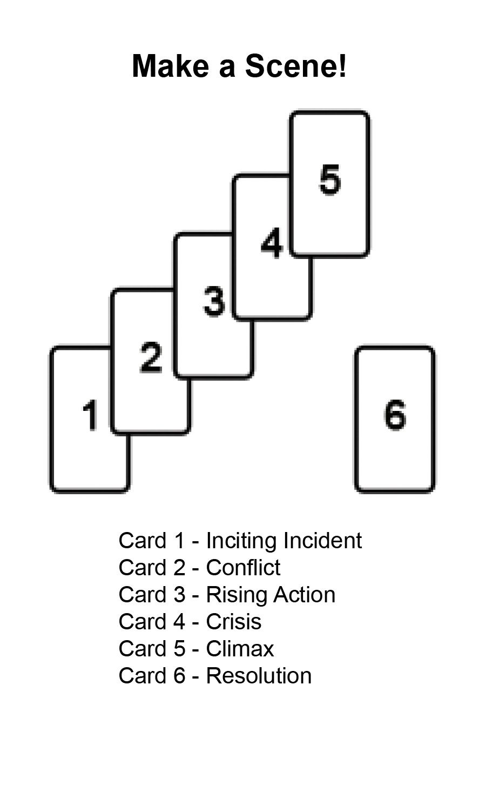
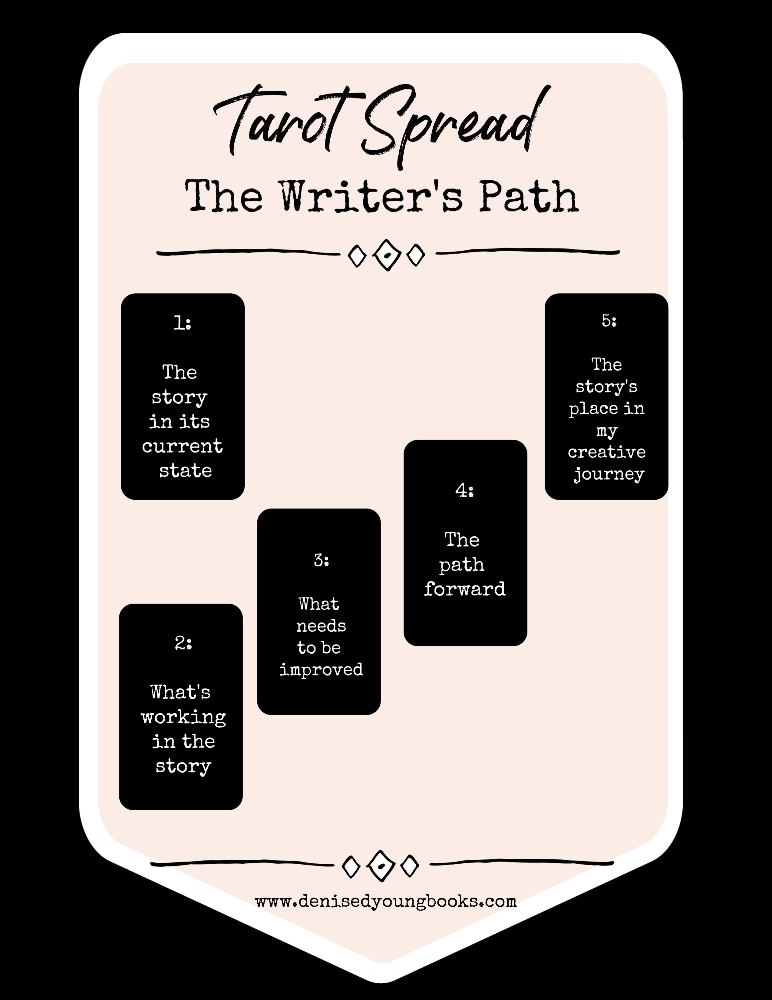
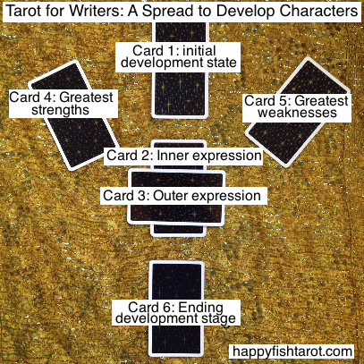
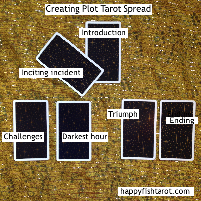
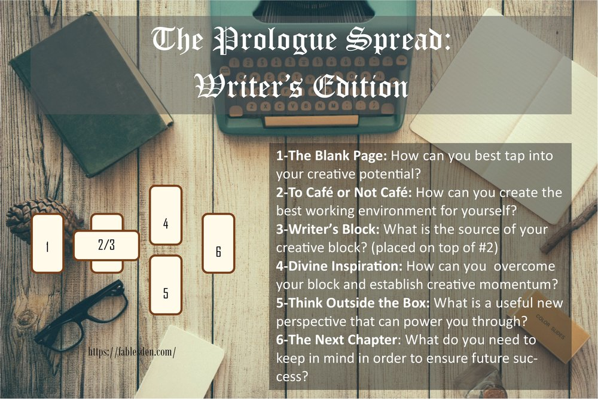
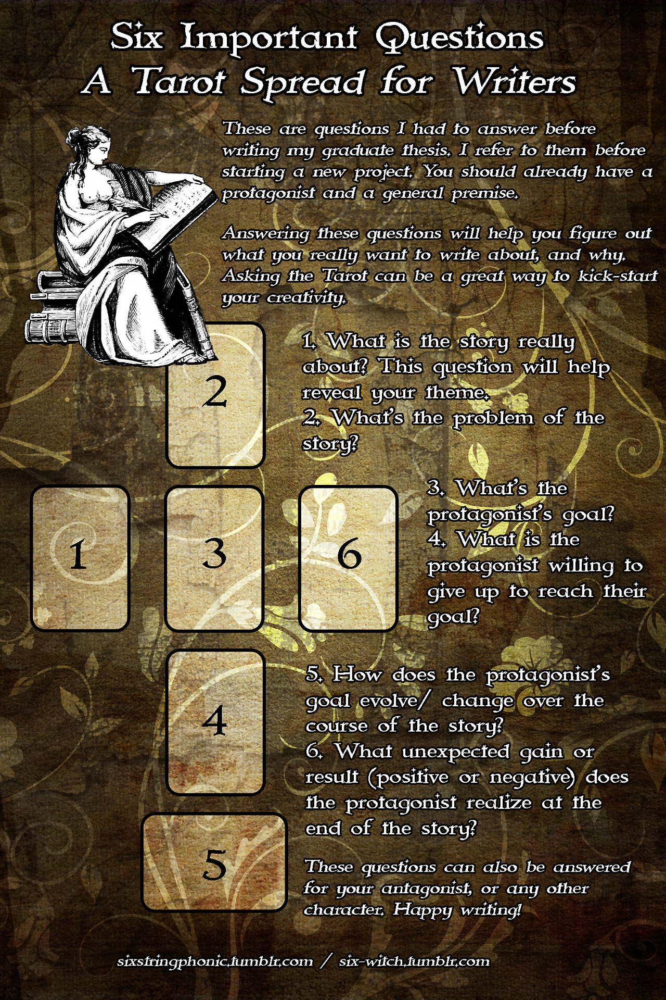

# P02 Research

## Writing games
- This one from that SAI writing event where each person started off writing a couple of words on a Google spreadsheet and then everyone shifted over to the next page to add more words by building off the previous person's words. There's a timer and theme to help keep things moving.
  - Maybe thinking of a theme/setting beforehand for the spread?

## Tarot spreads
- [Writing with Tarot: How the Cards Point the Way to Your Story](https://www.thecreativepenn.com/2018/12/14/writing-with-tarot-how-the-cards-point-the-way-to-your-story/)
- 
- 
- 
- 
- 
- 

## Miscellaneous

- [MANGA SENPAI [14] Storyboard | How to make manga by Japanese manga-ka](https://www.youtube.com/watch?v=Y3DC30oW8gE)
- [How the inventor of Mario designs a game](https://www.youtube.com/watch?v=K-NBcP0YUQI)
- ["Ki-sho-Ten-ketsu" is "KA-ME-HA-ME-HAA!" 4 part construction practicals - Japanese Manga 101 #051](https://youtu.be/Tfi0FvD9Yu0)

What if you used the imagery of the deck you're using to make the story?
- Ex: What is the card *doing*?
- Who/What is in the card?

Limits: 
- 1 sentence per act.
- 30 seconds to make each sentence.
- Don't worry about it making any sense
- 