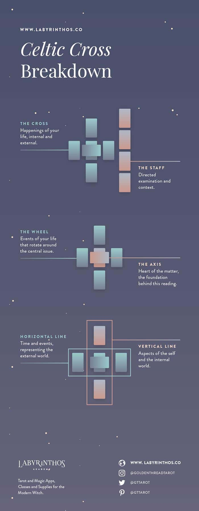

# P02 Research

## Writing games
- This one from that SAI writing event where each person started off writing a couple of words on a Google spreadsheet and then everyone shifted over to the next page to add more words by building off the previous person's words. There's a timer and theme to help keep things moving.
  - Maybe thinking of a theme/setting beforehand for the spread?

## Tarot spreads
- [Writing with Tarot: How the Cards Point the Way to Your Story](https://www.thecreativepenn.com/2018/12/14/writing-with-tarot-how-the-cards-point-the-way-to-your-story/)
- 
- 
- 
- 
- 
- 
- 
- [11 Popular Tarot Spreads for Beginners and Advanced readers](https://www.alittlesparkofjoy.com/easy-tarot-spreads/)

### Tarot cards
- what are the affordances and their signifiers inside tarot cards?

### The Celtic Cross
- [The Celtic Cross Tarot Spread - Exploring the Classic 10 Card Tarot Spread](https://labyrinthos.co/blogs/learn-tarot-with-labyrinthos-academy/the-celtic-cross-tarot-spread-exploring-the-classic-10-card-tarot-spread)
- 10 cards that help you analyze a problem/situation in your life.
- The cross discusses the querent's life.
  - The outer cards (the Wheel) discuss events related to the querent's issue.
  - The inner 2 cards (the Axis) describe the core aspects of the situation.
  - In the Horizontal line the Cross discusses events relative to time.
  - In the Veritcal line the Cross shows the internal state of the querent, such as what they might be thinking.
- The staff presents different perspectives using context.

## Miscellaneous

- [MANGA SENPAI [14] Storyboard | How to make manga by Japanese manga-ka](https://www.youtube.com/watch?v=Y3DC30oW8gE)
- [How the inventor of Mario designs a game](https://www.youtube.com/watch?v=K-NBcP0YUQI)
- ["Ki-sho-Ten-ketsu" is "KA-ME-HA-ME-HAA!" 4 part construction practicals - Japanese Manga 101 #051](https://youtu.be/Tfi0FvD9Yu0)

What if you used the imagery of the deck you're using to make the story?
- Ex: What is the card *doing*?
- Who/What is in the card?

Limits: 
- 1 sentence per act.
- 30 seconds to make each sentence.
- Don't worry about it making any sense

What info do players need to write a story?
- Players might need ingredients to fill in the Kishotenketsu acts.
- Common western fiction writing elements:
  - Characters
  - Setting
  - Situation
  - The Inciting Incident
  - 3/5 acts (they're the same thing, 2nd act is just divided into 3)
- There's writing prompts that give writers a head start.
  - [5 stars example](https://www.instagram.com/p/CX3P7-XMy60/)
    - ends with a twist
    - starts with a complication
  - HCW give the players some blanks to help them write?
    - Questions
      - [10 questions every writer should ask their story](https://www.johnyorkestory.com/2020/02/10-questions-every-writer-should-ask-their-story/)
        - 
    - Constraints
      - Provide a custom-made setting?
      - Make them write a pokemon scenario.

[The Kishotenketsu struture of Digimon Adventure tri: an insight to traditional Japanese storytelling](https://50cyg.tumblr.com/post/170018851160/the-kishotenketsu-struture-of-digimon-adventure)

[THE SKELETAL STRUCTURE OF JAPANESE HORROR FICTION](https://www.tofugu.com/japan/japanese-horror-structure/)

Tarot goal(s)? emotional journey of character. Story goal(s)? Construct narrative ASAP. Game goal(s)? Have fun writing and reading with Tarot.

[TV Tropes: Kishotenketsu](https://tvtropes.org/pmwiki/pmwiki.php/Main/Kishotenketsu)

[The significance of plot without conflict](https://stilleatingoranges.tumblr.com/post/25153960313/the-significance-of-plot-without-conflict)

story grammar

Can Story Grammar Speak Japanese?