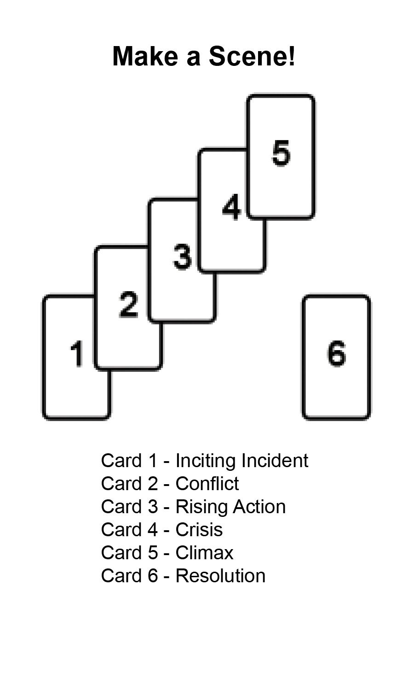
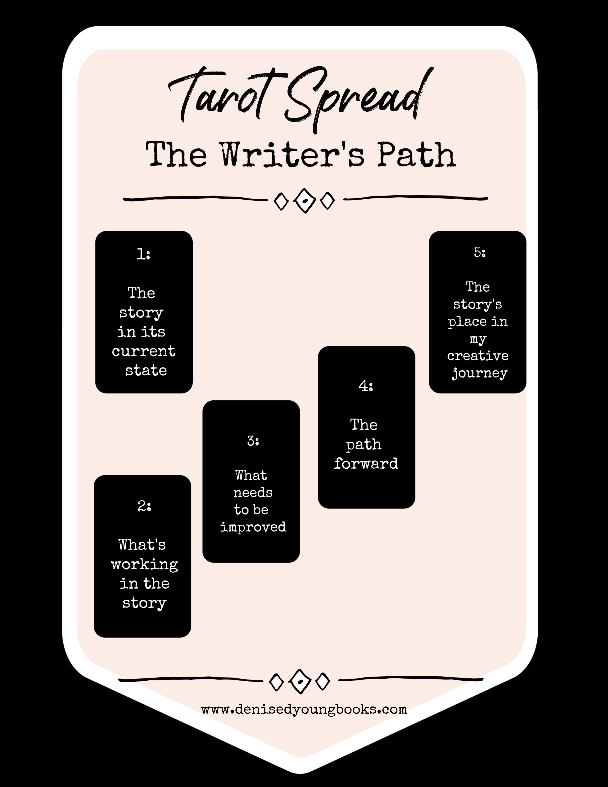
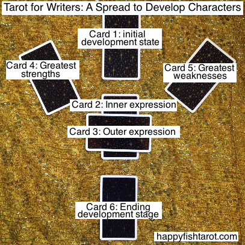
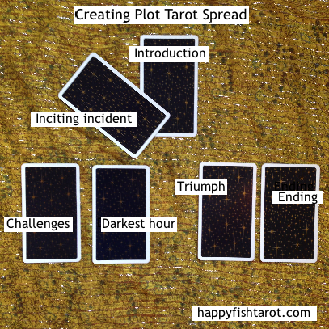
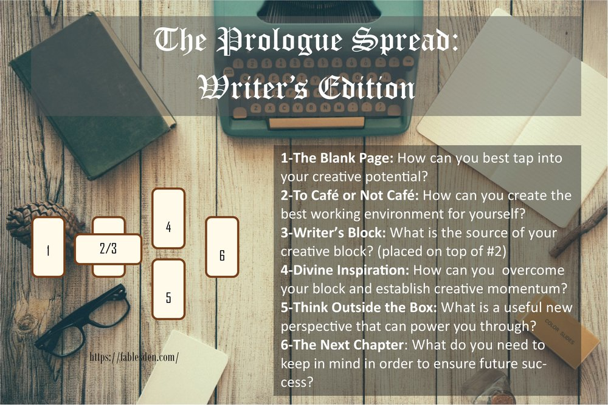
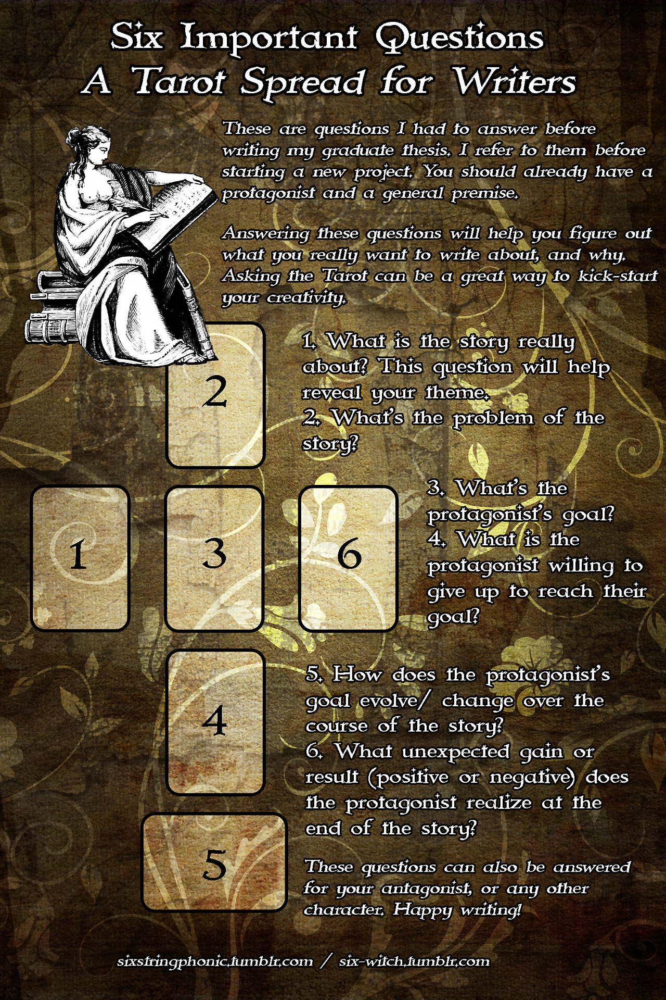
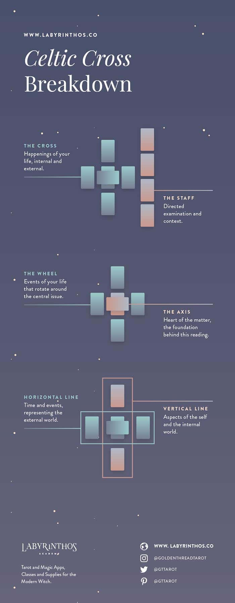

# P02 Research

## Writing games
- This one from that SAI writing event where each person started off writing a couple of words on a Google spreadsheet and then everyone shifted over to the next page to add more words by building off the previous person's words. There's a timer and theme to help keep things moving.
  - Maybe thinking of a theme/setting beforehand for the spread?

## Tarot spreads
- [Writing with Tarot: How the Cards Point the Way to Your Story](https://www.thecreativepenn.com/2018/12/14/writing-with-tarot-how-the-cards-point-the-way-to-your-story/)
- 
- 
- 
- 
- 
- 
- 
- [11 Popular Tarot Spreads for Beginners and Advanced readers](https://www.alittlesparkofjoy.com/easy-tarot-spreads/)

### Tarot cards
- what are the affordances and their signifiers inside tarot cards?

### The Celtic Cross
- [The Celtic Cross Tarot Spread - Exploring the Classic 10 Card Tarot Spread](https://labyrinthos.co/blogs/learn-tarot-with-labyrinthos-academy/the-celtic-cross-tarot-spread-exploring-the-classic-10-card-tarot-spread)
- 10 cards that help you analyze a problem/situation in your life.
- The cross discusses the querent's life.
  - The outer cards (the Wheel) discuss events related to the querent's issue.
  - The inner 2 cards (the Axis) describe the core aspects of the situation.
  - In the Horizontal line the Cross discusses events relative to time.
  - In the Veritcal line the Cross shows the internal state of the querent, such as what they might be thinking.
- The staff presents different perspectives using context.

## Miscellaneous

- [MANGA SENPAI [14] Storyboard | How to make manga by Japanese manga-ka](https://www.youtube.com/watch?v=Y3DC30oW8gE)
- [How the inventor of Mario designs a game](https://www.youtube.com/watch?v=K-NBcP0YUQI)
- ["Ki-sho-Ten-ketsu" is "KA-ME-HA-ME-HAA!" 4 part construction practicals - Japanese Manga 101 #051](https://youtu.be/Tfi0FvD9Yu0)

What if you used the imagery of the deck you're using to make the story?
- Ex: What is the card *doing*?
- Who/What is in the card?

Limits: 
- 1 sentence per act.
- 30 seconds to make each sentence.
- Don't worry about it making any sense

What info do players need to write a story?
- Players might need ingredients to fill in the Kishotenketsu acts.
- Common western fiction writing elements:
  - Characters
  - Setting
  - Situation
  - The Inciting Incident
  - 3/5 acts (they're the same thing, 2nd act is just divided into 3)
- There's writing prompts that give writers a head start.
  - [5 stars example](https://www.instagram.com/p/CX3P7-XMy60/)
    - ends with a twist
    - starts with a complication
  - HCW give the players some blanks to help them write?
    - Questions
      - [10 questions every writer should ask their story](https://www.johnyorkestory.com/2020/02/10-questions-every-writer-should-ask-their-story/)
        - 
    - Constraints
      - Provide a custom-made setting?
      - Make them write a pokemon scenario.

[The Kishotenketsu struture of Digimon Adventure tri: an insight to traditional Japanese storytelling](https://50cyg.tumblr.com/post/170018851160/the-kishotenketsu-struture-of-digimon-adventure)

[THE SKELETAL STRUCTURE OF JAPANESE HORROR FICTION](https://www.tofugu.com/japan/japanese-horror-structure/)

Tarot goal(s)? emotional journey of character. Story goal(s)? Construct narrative ASAP. Game goal(s)? Have fun writing and reading with Tarot.

[TV Tropes: Kishotenketsu](https://tvtropes.org/pmwiki/pmwiki.php/Main/Kishotenketsu)

[The significance of plot without conflict](https://stilleatingoranges.tumblr.com/post/25153960313/the-significance-of-plot-without-conflict)

story grammar

Can Story Grammar Speak Japanese?
- Sample of 20 random stories from a book
- Lack of desire in characters: Buddhist values
- Japanese stories don't need "resolutions" per Western storytelling. Stories are allowed to just end. <-- double check on this

[Persona 5 and Jungian Psychology - Masks, Major Arcana, and Meaning - Extra Credits](https://www.youtube.com/watch?v=4a4EdAES0fk)
- Jungian psychology: focuses on unconscious mind
- Personas = masks we wear in society
  - evolutionary mechanism to survive in groups
  - issue: potential identity crisis
- Shadow = area of psyche with repressed feelings
  - not dealing with shadow can overwhelm
- Anima and Animus = Female and Male traits, respectively
  - Conflict comes from not embracing your less dominant aspect
- Collective unconscious = pool of symbols and archetypes in human civilization
- Archetype = sub-structures of our personalities
  - Personality templates
- Tarot in persona = major arcana are each archetypical symbols
  - major arcana = archetypes for personas to come out of

[Persona 5: The Psychology Behind the Tarot's Archetypes (Part One)](https://www.youtube.com/watch?v=E1y24qmG7Zg)
- spoilers, so skipping this one

[Game Desiger's Tarot](https://cookiemoon.itch.io/game-designers-tarot)
- Generic TTRPG advice with generic spread reading so far
- Solid interpretations but it doesn't teach readers how to necessarily make those connections via rules.
- "Relevance, Lesson, Application" seems to be a practical and useful spread for RPG design.
- Seems cool for RPG stuff, but not very applicable for this project
- They use Hunick et al's Aesthetics taxonomy for the MDA framework

[The Psychology of Tarot Card Readings: How Therapists Are Using Tarot To Treat Depression at MeetYourPsychic](https://apnews.com/press-release/kisspr/business-lifestyle-marketing-and-advertising-corporate-news-physical-fitness-176d23b5934367d4f5e52905ac984de6)
- Memory exercises using tarot cards to elicit self-reflection on the day
- Jungian archetypes help therapists form a baseline for conversation
  - **Def look into Jungian POV of Tarot**
- Storytelling
- new pov's
- journalling

[Improv Descriptions in 4 Sentences.](https://www.reddit.com/r/DMAcademy/comments/p5pl3l/improv_descriptions_in_4_sentences/)
- Summary desc., then 2 sentences with 1 sensation each (not vision), then whatever most likely grabs character's attention
- bonus: feeling or sense inbtwn the 2 sensation sentences

[Tarot and Numerology: What do numbers in Tarot Mean for the Minor Arcana? (Infographic)](https://labyrinthos.co/blogs/learn-tarot-with-labyrinthos-academy/tarot-and-numerology-what-do-numbers-in-tarot-mean-for-the-minor-arcana-infographic)
- For the **Minor Arcana**
- patterns of multiple numbers indicate certain meanings
- Aces/1s = raw energy; beginnings, potential & momentum, inspiration
- 2s = duality, choices, balance, union, separation
- 3s = Group dynamics (human or not), magic #, completion of a first step or other phase, growth
- 4s = foundations, manifestation, endurance, growth, evolution
- 5s = Change, fluctuation, conflict, movement, 
- 6s = Harmony, adjustment, alignment, reconciliation, denouement, resolution
- 7s = introspection, reflection, reevaluation, investigation, introspection
- 8s = completion of 2nd phase, achievement (materialistic/emotional/etc), growth, rebirth, changes
- 9s = near completion, entering plateau, transition period, attainment
- 10s = completion, completing cycles, coming full circle, moving forward, new beginning, 

[Tarot By Numbers: A Fast And Simple Way To Learn The Cards With Numerology](https://www.biddytarot.com/tarot-by-numbers/)
- Cups = Water = Emotions, creativity, intuition, relationships
- Pentacles = Earth = Material wealth, money, career, manifestation
- Swords = Air = Communication, truth, intellect, thoughts
- Wands = Fire = Inspiration, energy, enthusiasm
- Grammar: Number meaning --> Suite meaning.
  - Ex: 5 of Cups = change in relationships, conflict in emotions
- Court cards don't traditionally have numerological meanings
- Major arcana: Find sum of each digit in card's #.
  - Ex: 16 - The Tower = 1+6=7. 7 = reevaluation, introspection. 
  - There's also numerological meanings for numbers past 21
    - Ex: 13 = Upheaval (like Death), Karmic Debt Number (need to learn lesson to spiritually grow)

[Tarot Numerology: Learning the Meanings of Tarot Card Numbers](https://www.throughthephases.com/tarot-numerology/)
- Meanings 
  - Repeating = importance of numerical meaning, length of time
  - Sequential = show beginning and end of smth
- Reversed meanings
  - Aces/1s = blocked beginnings
  - 2s = disharmony, imbalance
  - 3s = focus on self, distancing from groups, stalling in current phase that prevents growth towards goal
  - 4s = lack of grounding, issues with creating stability or abandoning it for growth
  - 5s = denial/reluctance to face challenges, end of challenges, work done to overcome obstacles
  - 6s = imbalance, disharmony
  - 7s = too many options, lack of focus, tunnel vision, ignoring options
  - 8s = lack of material success, avoiding doing the work for success, repetitive cycles that hinder growth
  - 9s = lack of close/fulfilment, tie up loose ends before proceeding, refocus goals to reflect higher purpose/priorities
  - 10s = smth won't end, still need to do work to end current cycle

[How to Calculate Your Tarot Birth Card, Plus Short Birth Card Meanings: Infographic](https://labyrinthos.co/blogs/learn-tarot-with-labyrinthos-academy/how-to-calculate-your-tarot-birth-card-plus-short-birth-card-meanings-infographic)
- Birth cards are kind of like the zodiac
- Breakdown birthdate into 2 digit blocks for month, day, and year
  - MM + DD + YY + YY
- If sum is a 2 digit number, add digits together for 1st birth card. Then divide into 2 digits again for 2nd birth card if you get a single digit; otherwise reduce to 1 digit.
  - Ex: 11 + 22 + 20 + 00 = 53
    - 5 + 3 = 8: Strength, 1st card
    - 8 = 1 + 7 = 17: The Star, 2nd card
  - Ex: 07 + 30 + 19 + 26 = 82
    - 8 + 2 = 10: The Wheel of Fortune, 1st card
    - 1 + 0 = 1: The Magician, 2nd card
- If sum is 3 digit number, add first 2 digits with 3rd digit as a separate # for 1st birth card. Then add digits to find 2nd card or reduce to 1 digit.
  - 01 + 13 + 19 + 97 = 130
  - 13 + 0 = 13, Death, 1st card
  - 1 + 3 = 4, The Emperor, 2nd card
- Exception: When sum = 19, there's 3 birth cards.
  - Reason: Not very clear why you'd get 3 birth cards if your sum is 19.
- Combos (the querent's life journey)
  - 21 > 3: The World, Empress
    - Path of self-actualization guided by love.
  - 20 > 2: Judgement, High Priestess
    - Path of rebuilding yourself by following intuition
  - 19 > 10 > 1: The Sun, The Wheel, The Magician
    - Path of adapting to change with grace, abundance, peace
  - 18 > 9: The Moon, The Hermit
    - Path of finding clarity in darkness and truth in uncertainty.
  - 17 > 8: The Star, Strength
    - Path of finding hope by pulling from inner strength.
  - 16 > 7: The Tower, The Chariot
    - Path of restoring balance guided by discipline.
  - 15 > 6: The Devil, Lovers
    - Path of controlling desire by staying grounded. Sensuality guided by love.
  - 14 > 5: Temperance, The Hierophant
    - Path of finding inner peace by seeking knowledge.
  - 13 > 4: Death, Emperor
    - Path of establishing order upon upheaval.
  - 12 > 3: The Hanged Man, The Empress
    - Path of patiently progressing through delays.
  - 11 > 2: Justice, High Priestess
    - Path of uniting clarity and intuition.s
  - 10 > 1: wheel, Magician
    - Path of adapting to the times.

[The Tarot and the Tree of Life Correspondences](https://labyrinthos.co/blogs/learn-tarot-with-labyrinthos-academy/the-tarot-and-the-tree-of-life-correspondences)
- 22 Major arcana cards: 22 letters of Hebrew alphabet
- 4 suits: Tetragrammaton (God's 4 letter name)
- Tree of Life = diagram describing universal laws of reality
  - Downwards = human body, unconscious
  - Upwards = Divine source of soul, higher self
  - 10 nodes (sephirah; minor arcana), 22 connective paths (major arcana)
  - Each connective path is a lesson necessary to learn to move to next node. Collectively called the Path of the Serpent; represents journey to divine and to spiritual healing.
    - But they don't talk about what the lessons are?
    - I assume the lessons are related to each Major arcanum card's symbolic meaning.
    - Yeah the symbolic meanings don't line up either.
  - Each major arcana correlates with a letter of the Hebrew alphabet, which has its own semantic and symbolic meanings
    - Ex: The Fool corresponds to the letter Aleph, which semantically means Ox and symbolically means primal energy.
    - There's a whole table.
    - Ngl I have no clue how the Tarot cards relate to their supposed corresponding letters.
  - The Minor arcana suites each correspond to an element, letter, and world
    - Wands : Fire : Yod (Closed hand) : Atziluth (the world of Emanation; Divine; Faculty of intuition)
    - Cups : Water : He (window) : Beri'ah (world of creation; spirit; faculty of feeling)
    - Swords : Air : Vau (Hook, nail) : Yetzirah (world of formation, psyche, faculty of thinking)
    - Pentacles : Earth : He : Assiah (world of manifestation, body, faculty of sensation)
    - This is where the minor arcana suite "associations" come from
    - In the Kabbalah, there's 4 worlds, each of which correspond with a letter in the Tetragrammaton (Yod, He, Vau/waw, He)
      - They're all connected to make a ladder connecting the material and divine worlds; referred to as Jacob's Ladder, a stairway to heaven that Jacob dreamed about in the Bible.
      - Material world > formation world > Creation world > Emanation world (the source, the root)
      - Each world/suite is made of 10 nodes/cards (not counting court cards) that interlock with each other. Starts w/ 10 at the bottom, goes up to Ace at the top.
  - Each node is a diff aspect of God/Self/Pysche
    - Individually called a sephirah, collectively called a sephiroth
    - Top (the Ace) is closest to God/Self/Psyche, and as you go down closer you get to manifestation/material world. 
    - Ace of Wands is closest to Divine. 10 of Pentacles is closest to material world.
    - Ace/1 - Kether/Crown
      - Closest to god, unity, eternal source, pureness, potential
    - 2 - Chokmah/Wisdom
      - divine masculine, expression of full power of suit(?), insight
    - 3 - Binah/Understanding
      - divine feminine, harmony, contemplation
    - 4 - Chesed/Mercy
      - stability, discipline, structure, form
    - 5 - Geburah/Severity
      - destruction, motion, change, upheaval, chaos
    - 6 - Tiphareth/Beauty  
      - consciousness, balance, integration, connecting divine and physical
    - 7 - Netzach/Victory
      - strength, determination, concentration
    - 8 - Hod/Splendor
      - communication, expression of energy, reasoning, action, movement
    - 9 - Yesod/Foundation
      - refinement, reflection, imagination
      - To move to 8/Splendor, one must learn 
    - 10 - Malkuth/Kingdom
      - physical world, energies manifest, tangible form of all emanations
  - Nodes 2+3, 4+5, 7+8, are all counterparts/related in someway.
- Apparently the court cards are related to astrology

[An Introduction to Lenormand Cards: Plus Lenormand Card Meaning List](https://labyrinthos.co/blogs/learn-tarot-with-labyrinthos-academy/an-introduction-to-lenormand-cards-plus-lenormand-card-meaning-list)
- N/A

[The Differences Between Tarot Cards and Lenormand Cards](https://labyrinthos.co/blogs/learn-tarot-with-labyrinthos-academy/the-differences-between-tarot-cards-and-lenormand-cards)
- Most likely N/A

[How to Read Lenormand Card Combinations](https://labyrinthos.co/blogs/learn-tarot-with-labyrinthos-academy/how-to-read-lenormand-card-combinations)
- Pairs
  - Card 1 = Subject, Card 2 = Modifier (adverb, adjective)
  - Ex: House, Dog = [House] [of a Friend]
  - ExL Dog, House = [Pet] [of the Family]
- Lenormand cards lean towards being very literal and specific

[Kishotenketsu](https://tvtropes.org/pmwiki/pmwiki.php/Main/Kishotenketsu)
- "While often touted as a story format "without conflict", it is more accurate to say that kishotenketsu doesn't have a driving conflict — that is, a confrontation that the entire story revolves around. The third act twist is the centerpoint of the story, but while it may introduce a conflict, **characters don't actually have to engage with it (on-screen) in order for the story to conclude.** The twist is more often a Non Sequitur, e.g. **a sudden Perspective Flip that recontextualizes the story without changing its overall direction**, than an outright Plot Twist."
- "This allows him to introduce a new mechanic in a safe environment (ki), raise the stakes for the player (sho), put an unexpected complication on it (ten), and finally bring all previous ideas together for the home run to the finish pole (ketsu)."

[THE SKELETAL STRUCTURE OF JAPANESE HORROR FICTION](https://www.tofugu.com/japan/japanese-horror-structure/)/Can Story Grammar Speak Japanese?
- It's about who desires and who doesn't. The classical protagonist lacks desire. The classical antagonist engages in goal-seeking behavior that ends with his downfall. 
- Japanese stories can end with plot events or emphasis on the story's ideas or virtues. 
  - The former results in stories that "make sense". Things end somehow. The Western equivalent would attempt to resolve any unanswered dramatic questions based on plot events in its resolution.
  - The latter results in stories that "don't make sense", such as the ending of Urashima Taro, The Sopranos, or an Aesopian fable that ends with a focus on a moral lesson.
- If you notice a lot of J-Horror stories, they tend to involve protagonists such as regular students who don't do anything to kickstart the plot events. If anything, the plot events happen to them via actions that force them to react. 
- Japanese tales tend to involve a "simple reaction" and "action" structure w/o a goal for the protagonist, and a "complex reaction" and "goal-path" structure with a goal for the antagonist.
- Western stories tend to be about solving a problem/conflict, Japanese stories tend to be about discovering and understanding the truth of the matter at hand.
  - J-Horror stories tend to be about discovering the horrific severity of the situation.
  - Japanese stories tend to introduce a perspective in the Setup, elaborates on this perspective in the Development, introduces another perspective in the Twist that recontextualizes the first perspective, and reconciles the 2nd perspective with the 1st (aka explains wtf the 2nd perspective means/how it's connected to the 1st).
    - It's like an unfolding structure. You unfold a paper once to the left in Setup and then unfold it to the left once again in Development. Then you unfold it to the right once in Twist and again in that direction in Reconciliation to see the entire paper.
    - KTSK is like unfolding a folded piece of paper to see what it looks like completely unfolded. 
- Western storytelling usually has a change in the status-quo. Japanese storytelling usually doesn't change the status quo. The Twist doesn't change anything, rather it offers a new perspective on the status quo.

[How to Write a News Article: Headlines](https://spcollege.libguides.com/c.php?g=254319&p=1695321)
- "5-10 words at the most"
- "Use present tense and active verbs, but don't start with a verb"
- "Use infinitive form of verb for future actions"
- "Do not use articles - a, an, the"
- "Do not use conjunctions like and - you can substitute a comma"
- "Should be complete sentences or imply complete sentence"
- "Avoid repetition - Headlines summarize; they don't repeat the lede."
- "Don't use unidentified pronouns"
  - Ex: "They Win Pennant!"
- Additional grammar rules for sentences during play?

[How to master the art of headline writing](https://www.mediamatters-pr.co.uk/blog/master-art-headline-writing/)
- "Before you start writing or tapping the keyboard – think about the actual story you want to tell..."

[The Art Of Writing News](https://www.dailywritingtips.com/the-art-of-writing-news/)
- Inverted pyramid structure
  - Start w/ most important info, gradually end with least important info.